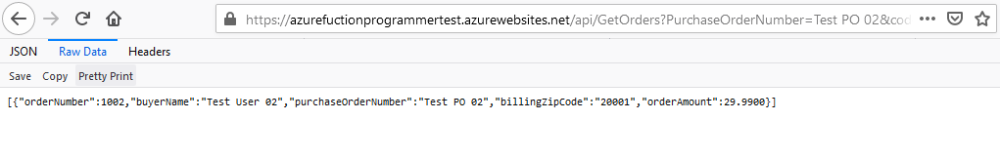
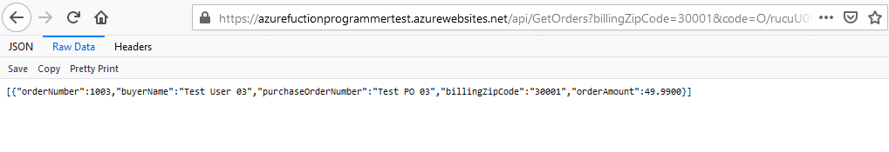

## GetOrdersSample

Send GET request to this url  
https://azurefuctionprogrammertest.azurewebsites.net/api/PostOrder?code=wg1yd6lkFOsund3n4KxoqPqA3KoRTj61pEj8ve4nWeaC4XD8lakjOA==

- Without any filter, returns all orders in the database. 
 https://azurefuctionprogrammertest.azurewebsites.net/api/GetOrders?code=kuIRSoezYc/IpAVszJZz2jDlxiywOjnIg4uHYaA1aM1A6v9xeH0tCQ== 
    
- Apply filter on BuyerName, only returns the matched record.
https://azurefuctionprogrammertest.azurewebsites.net/api/GetOrders?BuyerName=Test%20User%2004&code=kuIRSoezYc/IpAVszJZz2jDlxiywOjnIg4uHYaA1aM1A6v9xeH0tCQ==
    
- Apply filter on PurchaseOrderNum, only returns the matched record.
https://azurefuctionprogrammertest.azurewebsites.net/api/GetOrders?PurchaseOrderNumber=Test%20PO%2002&code=kuIRSoezYc/IpAVszJZz2jDlxiywOjnIg4uHYaA1aM1A6v9xeH0tCQ==
    
- Apply filter on BillingZipCode, only returns the matched record.
https://azurefuctionprogrammertest.azurewebsites.net/api/GetOrders?billingZipCode=30001&code=kuIRSoezYc/IpAVszJZz2jDlxiywOjnIg4uHYaA1aM1A6v9xeH0tCQ==
    
