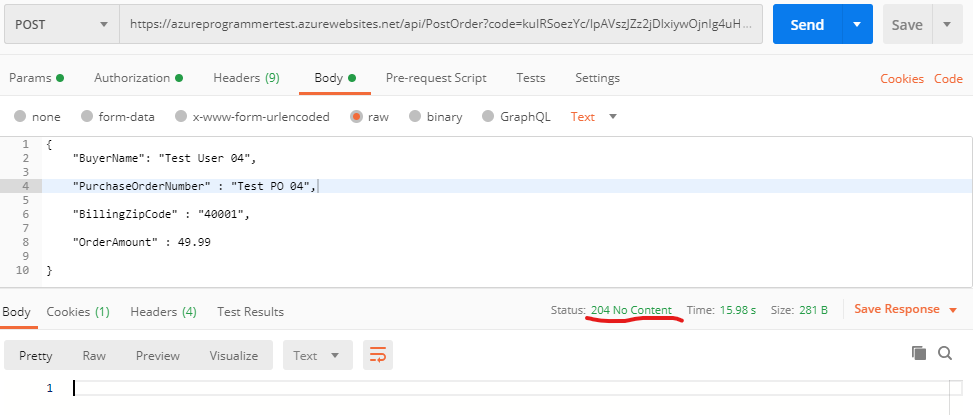
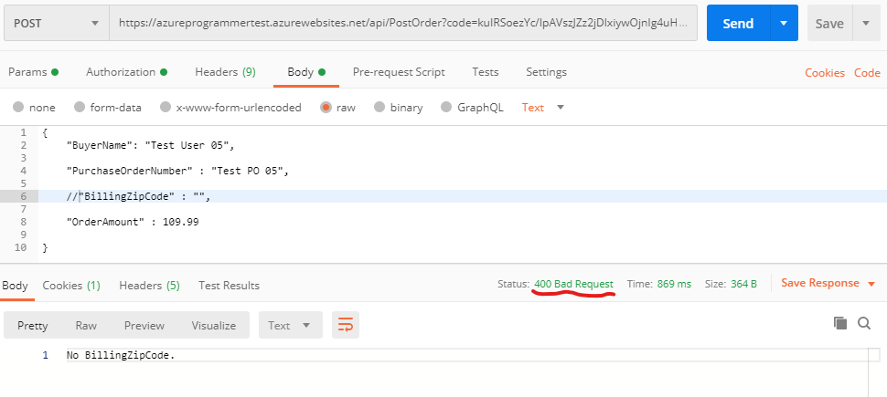
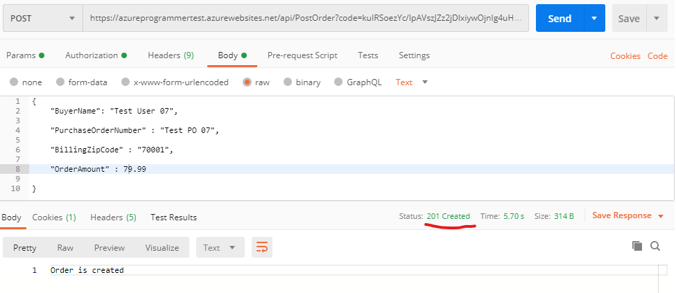

## Post Sample

Send post request to this url  
    https://azureprogrammertest.azurewebsites.net/api/PostOrder?code=kuIRSoezYc/IpAVszJZz2jDlxiywOjnIg4uHYaA1aM1A6v9xeH0tCQ== 
    
- PurchseOrderNumber exists in the database, return http status code 204

    

- BillingZipCode is missing, reject it with http status code 400

    

- Order is created successfully, return http status code 201

    
